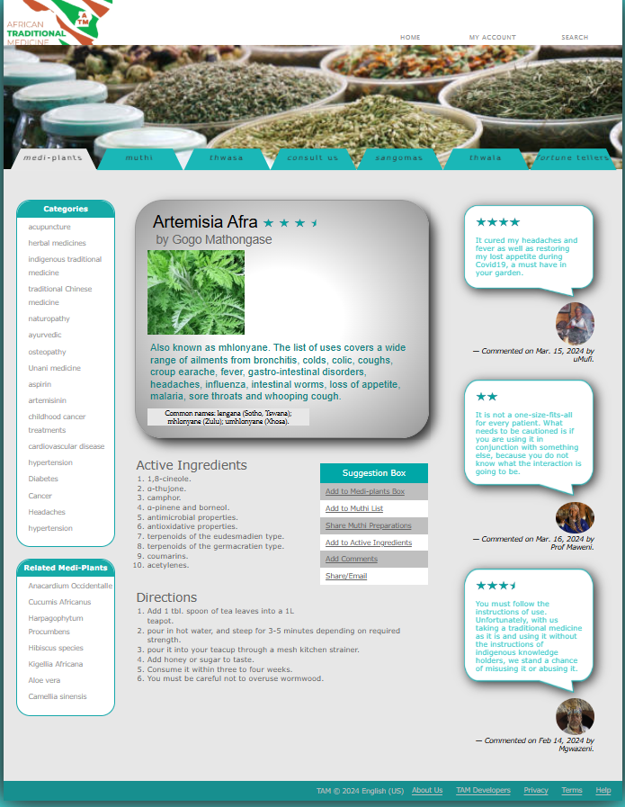
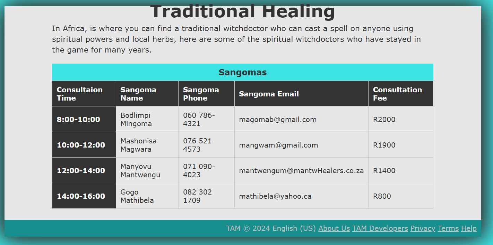

# Traditional African Medicine (TAM) Website

A comprehensive website showcasing Traditional African Medicine, featuring indigenous herbalism, traditional healers, and medicinal plant information.

## 🌿 Project Overview

Traditional African medicine is a holistic discipline involving the use of indigenous herbalism combined with aspects of African spirituality. This website was developed to share information about traditional healers and medicinal plants with the community, as part of the National Department of Health's initiative to officially recognize and institutionalize Traditional African Medicine.

## ✨ Features

### Home Page (`tam_home.html`)
- **Artemisia Afra Plant Information**: Detailed information about the medicinal plant "mhlonyane"
- **Active Ingredients**: Comprehensive list of chemical compounds and properties
- **Usage Directions**: Step-by-step preparation and consumption instructions
- **User Reviews**: Community feedback and ratings from users
- **Categories Navigation**: Links to various traditional medicine categories

### Sangomas Page (`tam_sangomas.html`)
- **Consultation Schedule**: Complete table showing Sangoma availability and fees
- **Traditional Healer Information**: Contact details and consultation times
- **Service Pricing**: Transparent fee structure for different time slots

## 🎨 Design Features

- **Responsive Layout**: Modern web design with proper width constraints
- **Visual Effects**: Drop shadows and gradient backgrounds
- **Color Scheme**: Teal and grey color palette reflecting traditional African aesthetics
- **Typography**: Professional font combinations for readability

## 📁 Project Structure

```
TAM/
├── tam_home.html          # Main homepage
├── tam_sangomas.html      # Sangomas consultation page
├── tam_base.css           # Base styling
├── tam_layout.css         # Layout and positioning styles
├── tam_effects.css        # Visual effects and animations
├── tam_sangomas.css       # Sangomas page specific styles
├── TAM_Logo1.png         # Main logo
├── mhlonyane.PNG         # Artemisia Afra plant image
├── tam_star.png          # Rating stars
├── tam_halfstar.png      # Half-star rating
├── tam_speech.png        # Speech bubble for reviews
├── mufi.PNG             # User profile images
├── maweni.PNG
├── mgwazeni.PNG
├── tam_medi_image1.jfif  # Traditional medicine images
├── tam_medi_image2.jfif
├── tam_medi_image3.jfif
├── tam_medi_image4.jfif
├── tam_medi_image5.jfif
├── tam_headerImage.jpg   # Header banner
├── tam_headerImage.png
├── med1.png
└── README.md
```

## 🌐 Website Screenshots

### Home Page

*The homepage features a clean layout with the Artemisia Afra plant information, user reviews, and navigation to different sections of traditional medicine.*

### Sangomas Consultation Page

*The Sangomas page displays a comprehensive table with consultation times, healer contact information, and service fees.*

> **Note**: Screenshots are stored in the `images/` folder. Current screenshots include:
> - `homepage-screenshot.png` - Main TAM homepage
> - `sangomas-screenshot.png` - Sangomas consultation page

## 🚀 Getting Started

### Prerequisites
- A modern web browser (Chrome, Firefox, Safari, Edge)
- No server required - runs as static HTML/CSS

### Installation
1. Clone the repository:
   ```bash
   git clone https://github.com/yourusername/traditional-african-medicine-website.git
   ```

2. Navigate to the project directory:
   ```bash
   cd traditional-african-medicine-website
   ```

3. Open `tam_home.html` in your web browser to view the website

## 🎯 Key Components

### CSS Architecture
- **Base Styles** (`tam_base.css`): Reset and fundamental styling
- **Layout Styles** (`tam_layout.css`): Positioning and structure
- **Effects** (`tam_effects.css`): Visual enhancements and animations
- **Page-specific** (`tam_sangomas.css`): Individual page styling

### HTML Structure
- Semantic HTML5 elements
- Accessible navigation
- Proper form structure for user interactions
- Responsive design principles

## 🌍 Cultural Significance

This website honors the rich tradition of African medicine, recognizing the vital role played by traditional healers in healthcare systems. It aligns with the WHO's Traditional Medicine strategy and supports African countries' commemoration of African Medicine Day every August 31st.

## 📚 Educational Value

The website serves as an educational resource for:
- Understanding traditional African medicinal plants
- Learning about consultation processes with traditional healers
- Exploring the holistic approach to healthcare in African culture
- Recognizing the integration of spirituality and medicine

## 🔧 Technical Details

- **HTML5**: Modern semantic markup
- **CSS3**: Advanced styling with gradients, shadows, and responsive design
- **Cross-browser Compatibility**: Tested on major browsers
- **Mobile Responsive**: Adapts to different screen sizes
- **Accessibility**: Proper alt tags and semantic structure

## 📞 Contact Information

For questions about traditional medicine or consultation services, please refer to the Sangomas page for healer contact details.

## 📄 License

This project is created for educational and cultural preservation purposes. Please respect the traditional knowledge and cultural significance of African medicine.

---

**Developed by**: VS Msimango  
**Date**: March 2024  
**Purpose**: Educational and Cultural Preservation of Traditional African Medicine
